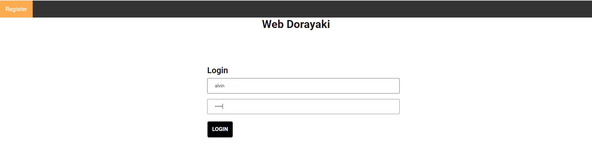
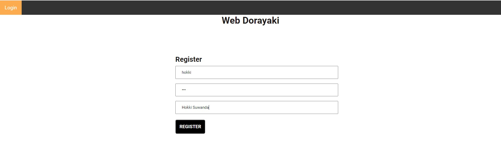
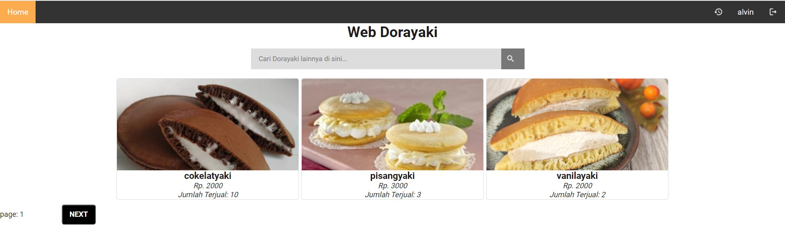
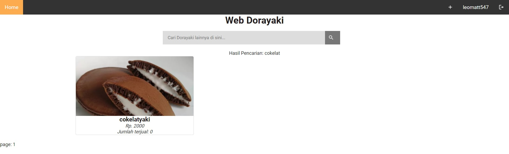
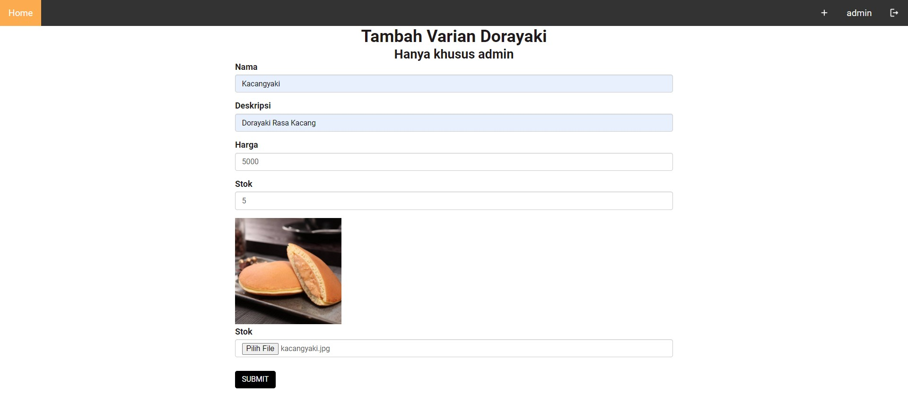
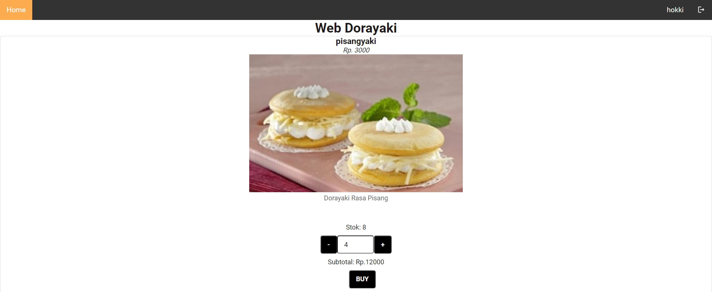
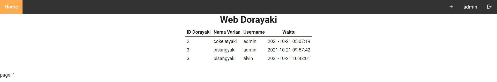

# dorayaki-web

Tugas Besar IF3110 - Pemrograman Berbasis Web

## Deskripsi Aplikasi Web

Web Dorayaki adalah sebuah web yang dapat menangani sistem transaksi pembelian dorayaki dengan sistem yang lebih update dan terpercaya. Dengan adanya aplikasi ini, diharapkan manajemen stok dan kebutuhan dorayaki di beberapa cabang bisa dikelola dengan baik.

## Requirement

### Local machine

1. php v8
2. composer 2.1.9

### With Docker

1. docker 20.10.9

## Cara instalasi

- Pastikan php versi > 8 sudah terinstall
  `https://www.php.net/manual/en/install.php`

## Cara menjalankan Server

- CARA MANUAL

  - `composer install`
  - `php -S localhost:3001`

- CARA DOCKER

  BUILD DOCKER IMAGE
  `docker build . --tag <nama image>`

  RUN DOCKER ON LOCAL MACHINE
  `docker run --network=host <nama image>`

## Screenshot Tampilan Aplikasi

### Tampilan Login

### Tampilan Register

### Tampilan Dashboard

### Tampilan Hasil Pencarian

### Tampilan Penambahan/Ubah Varian Dorayaki Baru

### Tampilan Pembelian Varian Dorayaki

### Tampilan Riwayat Pembelian Dorayaki

## Pembagian Tugas

### Server-side

- Login : 13519163
- Register : 13519163
- Dashboard : 13519215
- Hasil Pencarian: 13519215
- Penambahan Varian: 13519163, 13519215
- Pengubahan Detail Varian: 13519163, 13519215
- Detail Varian: 13619143
- Pengubahan Stok: 13619143
- Pembelian Dorayaki: 13619143

### Client-side

- Login : 13519163
- Register : 13519163
- Dashboard : 13519215
- Hasil Pencarian: 13519215
- Penambahan Varian: 13519163, 13519215
- Pengubahan Detail Varian: 13519163, 13519215
- Detail Varian: 13519143
- Pengubahan Stok: 13619143
- Pembelian Dorayaki: 13619143

### Bonus

- Data Expire Time: 13519163
- Responsive Design: 13519215
- Docker: 13519143
- Riwayat: 13519215
